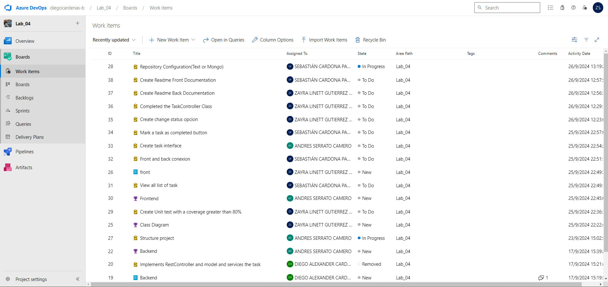

# Laboratory 4 - CVDS

## Nembers:
- **Diego Cardenas**
- **Sebastian Cardona**
- **Zayra Gutierrez**
- **Andres Serrato**

# Name of the project
- **TO-DO-CVDS**

# 1. Planificación del proyecto

Se llevó a cabo toda la planificación necesaria para iniciar el proyecto propuesto a través de Azure DevOps, 
donde se asignaron funciones específicas a cada integrante del equipo.

El proyecto se estructuró dividiéndolo en épicas, features, casos de uso y tareas. Nuestra épica principal es la **gestión de tareas**, que se desglosa en dos features: **frontend** y **backend**. Cada feature está asociada a casos de uso específicos, los cuales se han descompuesto en tareas más pequeñas para facilitar su desarrollo y seguimiento.

# 1.1 Diagrama de clases

Se realizó un diagrama de clases para representar la estructura de la aplicación y las relaciones entre las diferentes clases. En el diagrama se pueden observar las clases principales de la aplicación, así como sus atributos y métodos.

# 2. MODELO DE ARQUITECTURA CLIENTE-SERVIDOR

Comprender la arquitectura cliente-servidor.
Este modelo de arquitectura implica que el cliente realiza solicitudes al servidor, el cual se encarga de procesarlas y devolver los datos solicitados. Es el cliente quien inicia la interacción, mientras que el servidor gestiona dichas solicitudes y puede atender a varios clientes simultáneamente.

# 3. Desarrollo de la aplicación

Para el desarrollo de la aplicación se utilizó el framework de desarrollo web Spark, el cual permite crear aplicaciones web de forma sencilla y rápida. Spark se encarga de gestionar las rutas y las plantillas de la aplicación, permitiendo así la creación de aplicaciones web dinámicas.

# 4. Manejo de dependencias

Para manejar las dependencias del proyecto se utilizó Maven, una herramienta de gestión de proyectos que permite la gestión de dependencias, la compilación y la ejecución de pruebas de forma sencilla. Maven se encarga de descargar las dependencias necesarias para el proyecto y de gestionar las tareas de compilación y ejecución del mismo.
y Con ayuda de Spring Initializr se creó el proyecto con las dependencias necesarias para el desarrollo del mismo.

# 5. Manejo de base de datos MongoDB

Para el manejo de la base de datos se utilizó MongoDB, una base de datos NoSQL que permite almacenar datos de forma flexible y escalable. MongoDB se caracteriza por su flexibilidad y su capacidad para gestionar grandes volúmenes de datos, lo que lo convierte en una opción ideal para aplicaciones web que requieren un almacenamiento eficiente de datos.
En el paquete **resources**, dentro del archivo **application.properties**, se añadió la configuración correspondiente a la base de datos.

# 5.1. 

El sistema permitirá al usuario elegir el método de almacenamiento de la base de datos entre dos opciones: un archivo plano en formato JSON o una base de datos MongoDB.

- **Archivo plano en JSON**: Los datos se guardarán en un archivo local con formato JSON. Este formato es ligero y fácil de manejar, lo que lo hace adecuado para proyectos pequeños o cuando se requiere portabilidad de los datos sin depender de un servidor de base de datos.

- **MongoDB**: Si elige MongoDB, los datos serán almacenados en una base de datos NoSQL, ideal para manejar grandes volúmenes de información de manera eficiente y escalable. MongoDB permite consultas más complejas y es adecuado para aplicaciones que requieren mayor capacidad y rendimiento en la gestión de datos.

# 6. Pruebas Unitarias 

Las clases `TaskControllerTest`, `TaskServiceTest`, `TaskRepositoryTest` y `TaskConfigTest` no solo verifican el comportamiento esperado de las clases, sino que también permiten medir la calidad del código utilizando JaCoCo. Esta herramienta de cobertura de código ayuda a determinar qué porciones del código han sido ejecutadas durante las pruebas, proporcionando métricas esenciales sobre su calidad y nivel de testeo.

En total se realizaronn 59 pruebas unitarias, las cuales se ejecutaron con éxito.

# 7. Cobertura  con Jacoco

Para verificar la cobertura de las pruebas unitarias se utilizó Jacoco, una herramienta que permite medir la cobertura de las pruebas realizadas en un proyecto. Jacoco se encarga de analizar el código fuente y de generar un informe detallado con la cobertura de las pruebas realizadas.

